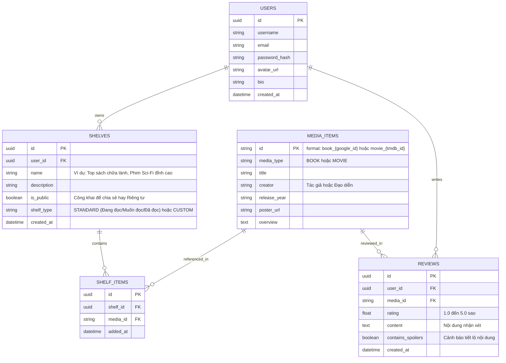

# Kế Hoạch Triển Khai: Nền Tảng Mạng Xã Hội & Review Sách - Phim (Book & Movie Social Hub)

Dự án này là một bước tiến vượt bậc so với đồ án mẫu `libraryWebsite-React`: kết hợp mô hình của **Goodreads** (dành cho sách) và **Letterboxd** (dành cho phim), bổ sung tính năng chia sẻ "Giá sách / Danh sách phim" (Custom Shelves) cho cộng đồng.

---

## 1. Đánh Giá Ý Tưởng & Chiến Lược Dữ Liệu (API)

> [!TIP]
> **Nhận định của Thầy về việc dùng API:**
> Ý tưởng dùng API bên ngoài của em là **HOÀN TOÀN CHÍNH XÁC và RẤT THÔNG MINH**!
> Trong thực tế, không ai nhập thủ công hàng vạn cuốn sách hay bộ phim vào cơ sở dữ liệu. Thay vào đó, ta sử dụng **Mô hình Hybrid Cache**:
> - Dùng API để tìm kiếm và lấy thông tin chi tiết (ảnh bìa, diễn viên/tác giả, tóm tắt).
> - Chỉ lưu vào Database nội bộ những sách/phim nào **đã có người dùng tương tác** (được thêm vào giá sách, được chấm sao hoặc được viết review). Cách này giúp hệ thống vừa nhẹ, vừa luôn cập nhật dữ liệu mới nhất toàn cầu.

### Các API miễn phí và chuẩn nhất cho dự án:
1. **Dữ liệu Sách (Books)**:
   - **Google Books API**: Miễn phí, cực kỳ phổ biến, hỗ trợ tìm kiếm theo tên sách, tác giả, ISBN, có sẵn ảnh bìa và tóm tắt.
     - Endpoint mẫu: `https://www.googleapis.com/books/v1/volumes?q={từ_khóa}`
   - **Open Library API**: Không cần API Key, mã nguồn mở, rất phù hợp làm nguồn dự phòng.
2. **Dữ liệu Phim (Movies)**:
   - **The Movie Database (TMDB) API**: Tiêu chuẩn vàng của ngành công nghiệp phim (chính là API mà Letterboxd sử dụng), hoàn toàn miễn phí cho dự án cá nhân/học tập, hỗ trợ đa ngôn ngữ (có cả tiếng Việt), poster chất lượng cao và trailer YouTube.
     - Endpoint mẫu: `https://api.themoviedb.org/3/search/movie?query={từ_khóa}&api_key={key}`

---

## 2. Kiến Trúc Kỹ Thuật Đề Xuất (Modern Tech Stack)

Khác với công nghệ năm 2019 của dự án cũ, dự án mới sẽ xây dựng trên nền tảng hiện đại:

| Tầng | Công nghệ | Lý do lựa chọn cho người mới bắt đầu |
| :--- | :--- | :--- |
| **Frontend** | **React (Vite) + Tailwind CSS** | Vite khởi động và build siêu nhanh; Tailwind CSS giúp xây dựng giao diện hiện đại, responsive cực đẹp mà không cần viết CSS rối rắm. |
| **UI Icons & Animation** | **Lucide-React + Framer Motion** | Bộ icon hiện đại và hiệu ứng mượt mà chuẩn xu hướng 2026. |
| **Backend** | **Node.js + Express.js** (REST API) | Cực kỳ trực quan, dễ học, dễ debug, hệ sinh thái phong phú. |
| **Database** | **PostgreSQL** (Cloud: Supabase / Neon) | CSDL quan hệ mạnh mẽ, đáng tin cậy. Dịch vụ Cloud miễn phí không cần cấu hình phức tạp trên máy. |
| **ORM / Data Access** | **Prisma ORM** | Giúp viết câu lệnh database bằng JavaScript/TypeScript an toàn, tự sinh migration và có công cụ trực quan `Prisma Studio`. |
| **Authentication** | **JWT (JSON Web Token) + bcrypt** | Tiêu chuẩn xác thực tài khoản an toàn cho ứng dụng web. |

---

## 3. Thiết Kế Cơ Sở Dữ Liệu Chuẩn (Database Schema)

Khắc phục lỗi lưu chuỗi JSON thô trong dự án cũ, CSDL mới được chuẩn hóa theo mô hình quan hệ:

---

## 4. Lộ Trình Triển Khai Từng Bước (5 Giai Đoạn)

### Giai đoạn 1: Khởi tạo & Làm chủ API Sách / Phim (Tuần 1)
- **Mục tiêu**: Làm quen với cách gọi API ngoài và hiển thị giao diện.
- **Công việc cụ thể**:
  1. Khởi tạo dự án Frontend bằng Vite: `npm create vite@latest client -- --template react`.
  2. Cài đặt Tailwind CSS.
  3. Đăng ký tài khoản và lấy API Key miễn phí từ [TMDB](https://www.themoviedb.org/documentation/api) và kích hoạt Google Books API.
  4. Xây dựng giao diện trang chủ:
     - Ô tìm kiếm đa năng (Search bar).
     - Component hiển thị danh sách dạng lưới (Grid) các cuốn sách hoặc bộ phim tìm thấy.
     - Modal hoặc trang chi tiết (Detail page): xem tóm tắt, điểm số, ngày phát hành, trailer (nếu là phim).

### Giai đoạn 2: Xây dựng Backend & Cơ sở dữ liệu (Tuần 2)
- **Mục tiêu**: Xây dựng máy chủ Express kết nối PostgreSQL và lưu trữ dữ liệu.
- **Công việc cụ thể**:
  1. Khởi tạo backend: `npm init -y`, cài đặt `express`, `cors`, `dotenv`, `prisma`, `@prisma/client`.
  2. Tạo Database PostgreSQL miễn phí trên Neon hoặc Supabase.
  3. Viết schema Prisma cho các bảng: `User`, `MediaItem`, `Shelf`, `ShelfItem`, `Review`.
  4. Xây dựng hệ thống Đăng ký / Đăng nhập:
     - Mã hóa mật khẩu bằng `bcryptjs`.
     - Tạo token xác thực bằng `jsonwebtoken (JWT)`.
     - Viết middleware kiểm tra đăng nhập (`authMiddleware`).

### Giai đoạn 3: Tính năng "Giá Sách / Kệ Phim" (Custom Shelves) (Tuần 3)
- **Mục tiêu**: Thực hiện tính năng cốt lõi tạo nên sự khác biệt của ứng dụng.
- **Công việc cụ thể**:
  1. Mặc định tạo 3 giá mặc định cho mỗi user khi đăng ký:
     - *Muốn đọc / Muốn xem (Want to Read / Watch)*.
     - *Đang đọc / Đang xem (Currently Reading / Watching)*.
     - *Đã hoàn thành (Finished)*.
  2. Tính năng tạo **Giá tùy chỉnh (Custom Shelf)**:
     - Đặt tên (vd: "Sách phát triển bản thân tuổi 20", "Phim trinh thám hack não").
     - Thêm / bớt sách và phim vào giá.
     - Nút gạt Công khai (Public) hoặc Riêng tư (Private).
  3. Tạo đường dẫn chia sẻ (Shareable Link): Mỗi giá sách công khai sẽ có 1 đường link riêng (ví dụ `/shelf/:id`) để người dùng gửi cho bạn bè hoặc đăng lên mạng xã hội.

### Giai đoạn 4: Tính năng Đánh giá (Review) & Gợi ý (Suggestions) (Tuần 4)
- **Mục tiêu**: Biến nền tảng thành một cộng đồng trao đổi sôi nổi.
- **Công việc cụ thể**:
  1. Chấm điểm sao (Star Rating) từ 1 đến 5 sao.
  2. Viết nhận xét kèm gắn cờ cảnh báo Spoilers (tiết lộ nội dung).
  3. Hiển thị điểm đánh giá trung bình từ cộng đồng người dùng trên trang web.
  4. Hệ thống gợi ý cơ bản (Smart Suggestions):
     - Gợi ý dựa trên cùng Thể loại (Genre) mà người dùng vừa đánh giá cao.
     - Gợi ý các sách/phim đang "Hot" (được nhiều người thêm vào giá sách nhất trong tuần).

### Giai đoạn 5: Hoàn thiện UI/UX & Triển khai lên Internet (Deployment) (Tuần 5)
- **Mục tiêu**: Hoàn thiện sản phẩm chuyên nghiệp để đưa vào CV/Portfolio.
- **Công việc cụ thể**:
  1. Tối ưu giao diện trên Mobile (Responsive Design).
  2. Thêm Dark Mode (chế độ nền tối - rất hợp với web phim/sách).
  3. Deploy Backend lên Render hoặc Railway (miễn phí).
  4. Deploy Frontend lên Vercel hoặc Netlify (miễn phí).

---

## 5. Kế Hoạch Kiểm Thử (Verification Plan)

### Kiểm thử Tích hợp API:
- Kiểm tra việc tìm kiếm sách bằng tiếng Việt và tiếng Anh trên Google Books API.
- Kiểm tra hiển thị hình ảnh poster từ TMDB khi kết nối mạng chậm.

### Kiểm thử Tính Năng Người Dùng:
1. Đăng ký tài khoản mới -> Đăng nhập nhận JWT Token.
2. Tìm 1 cuốn sách (ví dụ: *Đắc Nhân Tâm*) -> Thêm vào giá sách tự tạo "Sách gối đầu giường".
3. Lấy link giá sách đó mở bằng tab ẩn danh -> Đảm bảo khách vãng lai vẫn xem được sách trong giá sách công khai.
4. Viết 1 review kèm chấm 5 sao -> Kiểm tra điểm trung bình của cuốn sách được cập nhật.
